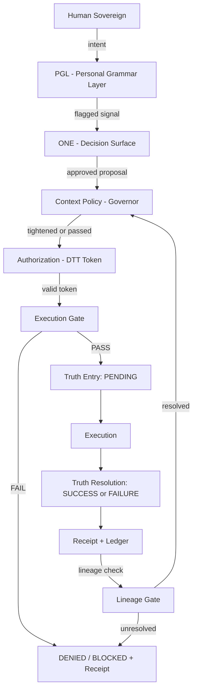
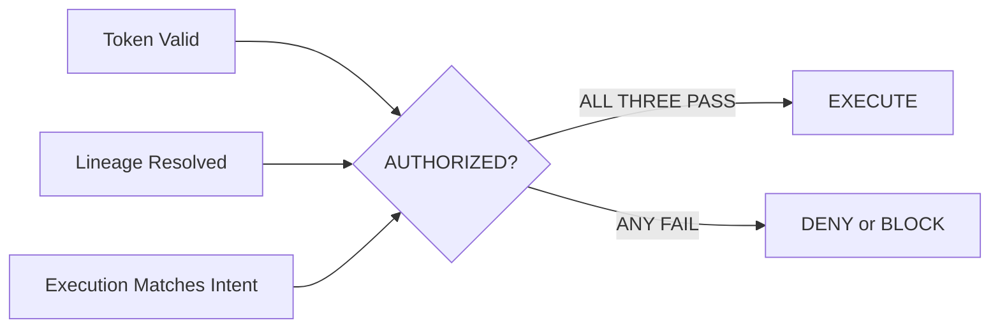

# RIO — Architecture Overview

> Derived from: /specs/canonical/RIO_CANONICAL_SPEC_v1.0.md

---

## One Line

RIO is the boundary between intention and consequence. Nothing crosses it without permission, proof, and record.

---

## System Flow



---

## Invariant Diagram



**All three conditions must hold simultaneously. No substitution permitted.**

---

## Layer Map

| Layer | Role | Failure Mode Prevented |
|---|---|---|
| PGL | Signal / language boundary | Momentum and ambiguity |
| ONE | Human decision surface | Agency drift |
| Context Policy | Policy modifier | Unconstrained authorization |
| Authorization (DTT) | Permission boundary | Unauthorized execution |
| Execution Gate | First enforcement boundary | Any invariant violation |
| Truth Layer | PENDING entry | Silent execution |
| Receipt + Ledger | Proof system | Information asymmetry |
| Lineage Gate | Dependency enforcement | Continuation on unresolved state |
| Witness / Sentinel | Observation only | Structural gaps (zero authority) |

---

## The Gate in Detail

```
Checks (strict order):

1. TOKEN_PRESENT       → missing → DENY (MISSING_TOKEN)
2. TOKEN_VALID         → expired or used → DENY (INVALID_TOKEN | TOKEN_USED)
3. TRACE_MATCH         → mismatch → DENY (TRACE_MISMATCH)
4. INTENT_BINDING      → hash mismatch → DENY (ACT_BINDING_MISMATCH)
5. LINEAGE_RESOLVED    → PENDING or FAILURE in deps → BLOCK (LINEAGE_UNRESOLVED)

First failure stops the chain. No partial pass.
```

---

## One Enforcement Gate. Two Structural Boundaries.

```
[ Authorization Boundary ]     ← produces valid inputs to the gate
         ↓
  [ EXECUTION GATE ]           ← the single moment reality changes
         ↓
  [ Truth Boundary ]           ← proves what happened after
```

All upstream components exist to produce valid gate inputs.  
All downstream components exist to prove what happened after the gate.

---

## What the System Does NOT Do

- Interpret intent
- Evaluate meaning
- Make decisions
- Learn at runtime
- Grant permission through context

It governs only: **whether an action is allowed to execute.**

---

*Derived from: /specs/canonical/RIO_CANONICAL_SPEC_v1.0.md*  
*Confidential — Brian K. Rasmussen — April 2026*
