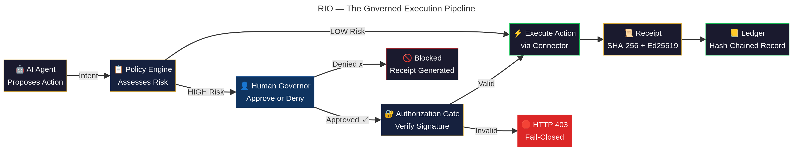
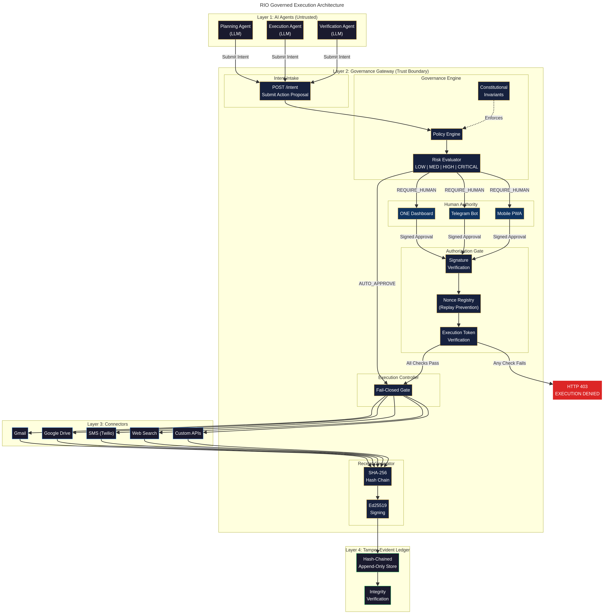

# RIO — Architecture Overview for First Meetings

**Author:** Andrew (Solutions Architect)
**Date:** 2026-04-03
**Purpose:** One document to walk through in a 30-minute technical introduction

---

## The Problem

Companies are deploying AI agents that take real-world actions: sending emails, moving money, deleting files, calling APIs, and modifying production systems. These agents are powerful, but they operate without accountability. There is no standard way to ensure a human authorized the action, no cryptographic proof of what happened, and no tamper-evident record for auditors.

Logging records what happened after the fact. RIO prevents unauthorized actions before they happen and proves what was authorized.

---

## The Solution: Two Layers

RIO is built as two distinct layers with different licensing models.

**Layer 1 — Receipt Protocol (Open Source, Free)**

Any developer can generate and verify cryptographic receipts for AI actions. Receipts are SHA-256 hashed and Ed25519 signed. They chain together into a tamper-evident ledger. SDKs are available in Node.js and Python. The goal is to make receipts the standard for AI action accountability — the way HTTPS became the standard for web security.

**Layer 2 — RIO Platform (Licensed)**

The governance engine that enforces Human-in-the-Loop control. It includes risk assessment (4-tier: LOW, MEDIUM, HIGH, CRITICAL), configurable policy rules, an approval queue with cryptographic signatures, a kill switch for emergency stop, and the ONE Command Center — the human dashboard for managing everything.

The receipt protocol creates adoption. The governance platform creates revenue.

---

## How It Works

The governed execution pipeline has six stages:

| Stage | What Happens | Who Acts |
|---|---|---|
| 1. **Propose** | AI agent submits an intent (what it wants to do) | AI Agent |
| 2. **Assess** | Policy engine evaluates risk tier | RIO (automatic) |
| 3. **Approve** | Human reviews and approves or denies (if required) | Human Governor |
| 4. **Authorize** | Cryptographic signature verified, nonce checked | RIO (automatic) |
| 5. **Execute** | Action performed through connector (Gmail, Drive, etc.) | RIO Connector |
| 6. **Record** | Receipt generated, signed, appended to hash-chained ledger | RIO (automatic) |

**The invariant:** No high-risk action executes without human authority, cryptographic proof, and an immutable record. If any check fails, the system returns HTTP 403 — fail-closed by design.

---

## What Is Built Today

The system is production-ready. The ONE Command Center is live and operational with the following capabilities:

| Capability | Status |
|---|---|
| AI orchestrator (OpenAI + Claude dual routing) | Production |
| Intent creation with 4-tier risk classification | Production |
| Human-in-the-Loop approval flow (Ed25519 signed) | Production |
| Execution gateway (Gmail, Search, SMS, Drive) | Production |
| Receipt generation and client-side verification | Production |
| Hash-chained ledger with integrity verification | Production |
| Custom policy rules (create, edit, toggle, delete) | Production |
| Kill switch (emergency stop) | Production |
| Telegram bot (inline approve/reject) | Production |
| PWA (installable on iOS/Android, offline-capable) | Production |
| Test suite | 298+ tests passing |

---

## Architecture Diagram

The architecture has four layers:

**Layer 1 — AI Agents (Untrusted).** Planning, Execution, and Verification agents submit intents. They are treated as untrusted — they can propose anything, but they cannot execute without authorization.

**Layer 2 — Governance Gateway (Trust Boundary).** This is the core of RIO. It contains the Intent Intake (POST /intent), the Governance Engine (Policy Engine, Risk Evaluator, Constitutional Invariants), the Human Authority interfaces (ONE Dashboard, Telegram Bot, Mobile PWA), the Authorization Gate (Signature Verification, Nonce Registry, Execution Token Verification), the Execution Controller (Fail-Closed Gate), and the Receipt Generator (SHA-256 Hash Chain, Ed25519 Signing).

**Layer 3 — Connectors.** Pluggable adapters for external services: Gmail, Google Drive, SMS (Twilio), Web Search, and custom APIs.

**Layer 4 — Tamper-Evident Ledger.** Hash-chained, append-only store with integrity verification. Each entry references the previous entry's hash. Any tampering breaks the chain and is immediately detectable.

---

## Deployment Options

| Model | Infrastructure | Setup Time | Best For |
|---|---|---|---|
| **Hosted** | Managed by RIO | 1-2 weeks | Fast adoption, no DevOps overhead |
| **Self-Hosted** | Customer infrastructure (Docker) | 2-4 weeks | Regulated industries, data residency |
| **Hybrid** | Receipts local, governance cloud | Days to weeks | Incremental adoption |

See [DEPLOYMENT_OPTIONS.md](DEPLOYMENT_OPTIONS.md) for full details.

---

## Integration

RIO integrates with any AI agent framework that can make HTTP calls. Specific patterns exist for OpenAI (function calling), Anthropic Claude (tool use), and LangChain (custom tool wrapper).

The integration is additive — RIO wraps the execution layer without replacing the customer's existing AI stack.

See [INTEGRATION_PATTERNS.md](INTEGRATION_PATTERNS.md) for implementation details and code examples.

---

## Competitive Position

| Approach | What It Does | What It Misses |
|---|---|---|
| "Just add logging" | Records what happened after the fact | Cannot prevent unauthorized actions; no cryptographic proof |
| Manual approval workflows | Adds human review | Does not scale; not cryptographically verifiable |
| AI safety frameworks | Controls what AI says | Does not govern what AI does |
| AI orchestration platforms | Coordinates agents | Does not enforce governance or produce receipts |
| **RIO** | Governs what AI does, proves what happened | — |

---

## Next Steps

1. **Live demo** — Visit the demo site or schedule a walkthrough
2. **Discovery call** — 30 minutes to understand requirements and compliance needs
3. **Technical deep dive** — Architecture walkthrough with the Solutions Architect
4. **Pilot proposal** — Scoped deployment plan with timeline and success metrics

Brian handles pricing discussions and pilot agreements directly.

---

*Intelligence proposes. Authority remains human.*
