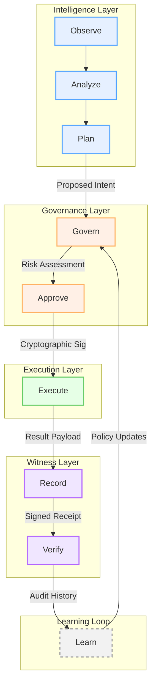

# RIO System Lifecycle

The RIO system operates on a continuous, 9-step lifecycle loop. This loop ensures that every action is governed, executed, recorded, and learned from.

## The 9-Step Lifecycle Loop

**Observe → Analyze → Plan → Govern → Approve → Execute → Record → Verify → Learn**

### Component Mapping

| Step | Action | Component | Description |
|---|---|---|---|
| 1 | **Observe** | Mantis / Observer | Monitors environment, receives signals, detects anomalies. |
| 2 | **Analyze** | AI / Intelligence | Processes observations, identifies patterns, determines goals. |
| 3 | **Plan** | AI / Intelligence | Translates goals into structured, proposed intents. |
| 4 | **Govern** | RIO Gateway | Evaluates intent against policy, calculates risk, determines approval requirements. |
| 5 | **Approve** | Human / Governor | Reviews high-risk intents and provides cryptographic approval (or denial). |
| 6 | **Execute** | RIO Gateway | Performs the approved action via external connectors (fail-closed). |
| 7 | **Record** | Receipt Protocol | Generates a cryptographically signed receipt of the execution. |
| 8 | **Verify** | Ledger | Writes the receipt to the immutable, hash-chained ledger for audit. |
| 9 | **Learn** | Policy Engine | Uses ledger history and execution outcomes to refine future policies. |

## Lifecycle Diagram

*This lifecycle is the standard model for all RIO deployments. It enforces the core invariants: AI proposes, humans approve, systems execute, receipts prove.*
