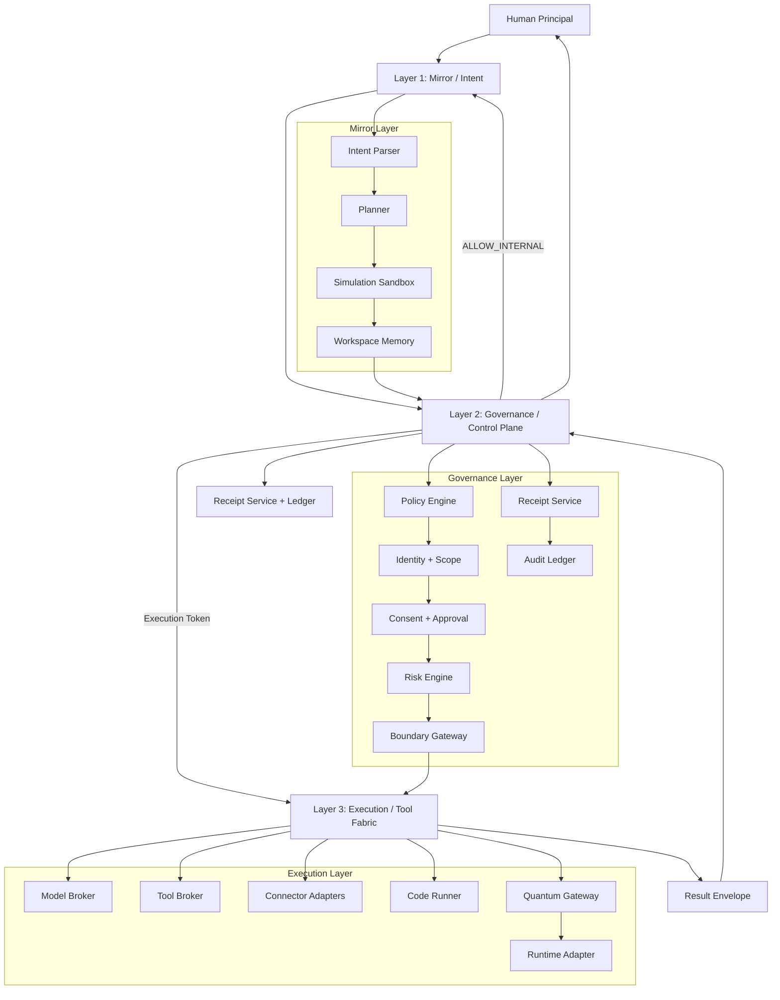

# ONE/RIO/MUSS Architecture

ONE/RIO/MUSS is a human-governed control plane for AI and hybrid quantum-classical execution. Its purpose is to allow extensive internal cognition, simulation, drafting, and research while preventing consequential external actions unless they are explicitly authorized, scoped, and receipted.

## Core idea

The system is built around three layers:

1. **Mirror layer** — intent formation, language interpretation, planning, drafting, simulation, and preparation.
2. **Governance layer** — policy enforcement, identity, scope, consent, risk checks, approvals, receipts, and audit trail.
3. **Execution layer** — models, tools, APIs, code runners, data systems, and optional quantum runtimes.

The architecture assumes a simple rule:

- Layer 1 may think.
- Layer 2 may decide.
- Layer 3 may act.

No tool or model may cross directly from planning to execution without passing through governance.

## Architecture diagram



## Layer responsibilities

### Layer 1 — Mirror / Intent

Responsibilities:
- Parse human language into goals, constraints, and success criteria.
- Decompose goals into task graphs.
- Simulate actions without causing external effects.
- Draft content, summarize findings, prepare decisions, and stage artifacts.
- Produce candidate action bundles for governance review.

Allowed by default:
- Research.
- Drafting.
- Summarization.
- Internal planning.
- Simulated workflows.
- Internal comparisons and analysis.

Forbidden by default:
- Sending emails.
- Moving money.
- Publishing changes.
- Using production credentials.
- Writing to external systems.

### Layer 2 — Governance / Control Plane

Responsibilities:
- Bind requests to a principal, device, session, and authority scope.
- Evaluate runtime policy.
- Determine whether a request is internal-only, pre-authorized, human-gated, or denied.
- Mint short-lived execution tokens.
- Require signed receipts for boundary crossings.
- Write append-only audit events.
- Support revocation, expiry, and incident review.

Canonical verdicts:
- `ALLOW_INTERNAL`
- `ALLOW_WITH_RECEIPT`
- `PREAUTHORIZED_EXTERNAL`
- `REQUIRE_HUMAN_APPROVAL`
- `DENY`

### Layer 3 — Execution / Tool Fabric

Responsibilities:
- Route work to approved models and tools.
- Normalize responses.
- Return metadata for receipts and audit.
- Support both classical and quantum execution paths.

Execution substrates:
- LLMs.
- Search.
- Filesystems.
- Code sandboxes.
- APIs and SaaS connectors.
- Databases.
- Email and messaging systems.
- IBM Quantum / Qiskit Runtime or other quantum services.

## Boundary crossing model

A crossing occurs whenever work leaves the safe internal domain and becomes capable of producing real-world consequence.

Crossings include:
- Sending or publishing something externally.
- Writing to a third-party system.
- Spending money or initiating payment.
- Deploying code or infrastructure.
- Using privileged credentials.
- Running a hardware quantum job with paid or controlled backend access.
- Modifying regulated or sensitive data.

Each crossing should carry:
- principal identity
- request hash
- declared scope
- consequence class
- data class
- approval mode
- receipt requirement
- expiry
- tool/backend target

## Governance as code

Policy should live in version control and be enforced at runtime.

Recommended structure:
- `policy-schema.yaml` for policy definitions
- `receipt-schema.json` for signed event shape
- `ledger/receipts.jsonl` for append-only receipt chain
- `examples/` for test fixtures and policy simulations

Governance rules should be:
- declarative
- testable
- reviewable
- revocable
- environment-aware
- minimal by default

## Quantum mapping

Quantum belongs in Layer 3.

That means:
- Mirror may request a quantum computation.
- Governance decides if the request may run, under what backend mode, and whether simulator or hardware is permitted.
- Execution submits the job and returns advisory or action-enabling results.
- Governance records the receipt and determines whether any downstream consequence is allowed.

Quantum must increase compute capability, not authority.

## Suggested repo layout

```text
/architecture
  ARCHITECTURE.md
  policy-schema.yaml
  receipt-schema.json
  examples/
    sample-receipt.json
    sample-ledger.jsonl
/src
  mirror/
  governance/
  execution/
  connectors/
  quantum/
/ledger
  receipts.jsonl
/docs
  positioning.md
  threat-model.md
```

## Minimal implementation order

1. Finalize architecture and terms.
2. Define policy schema.
3. Define receipt schema.
4. Stand up boundary gateway.
5. Add receipt service and append-only ledger.
6. Wrap one low-risk connector such as GitHub or file export.
7. Add simulator-first quantum adapter.
8. Add human approval UI for high-consequence crossings.
9. Add replay, audit, and policy test harness.

## Product description

A concise description for the repo and public materials:

> ONE/RIO/MUSS is a human-authorized control plane for AI and hybrid quantum-classical systems. It allows continuous internal reasoning, simulation, and preparation while gating consequential external actions through policy, receipts, and runtime boundary enforcement.
